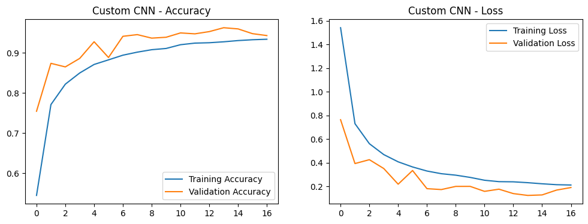
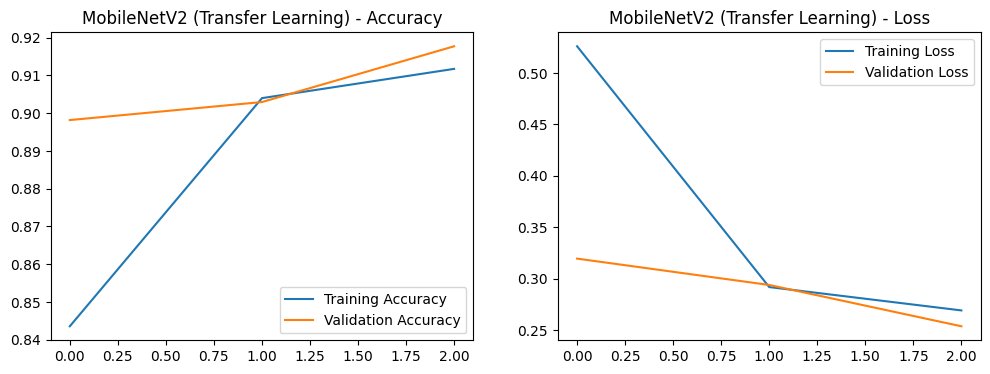
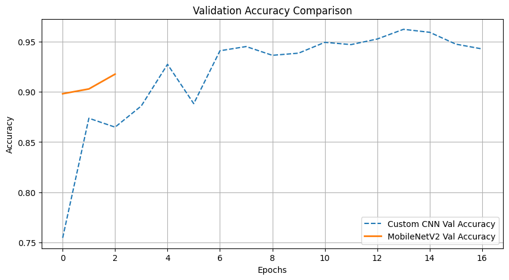
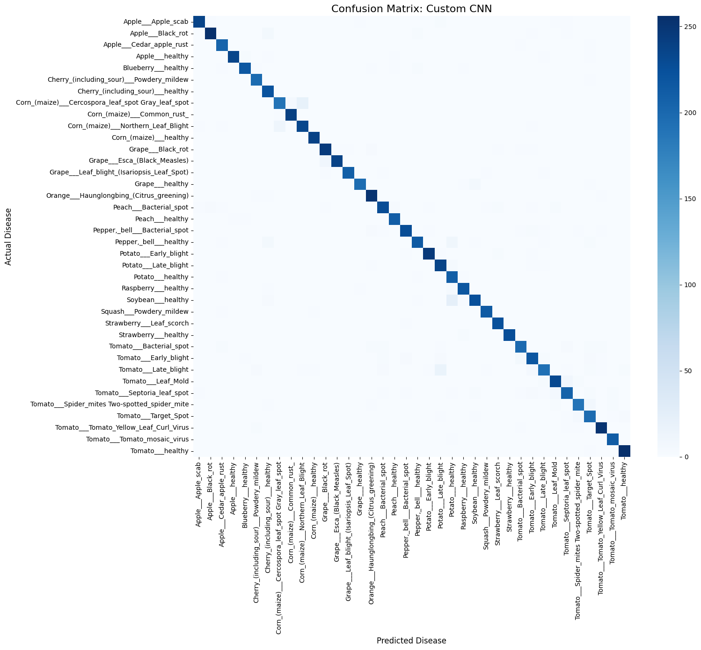
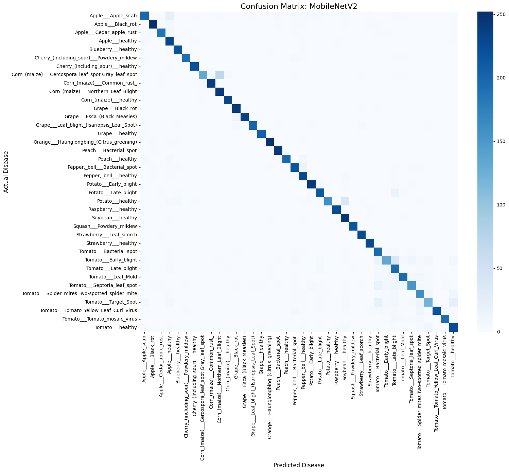
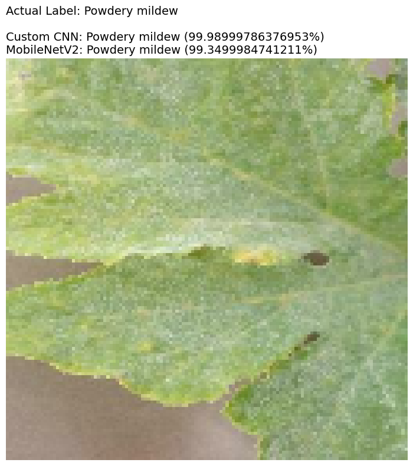

# 🌿 Plant Disease Detection: Custom CNN vs Transfer Learning

## 📌 Project Overview
This project implements an end-to-end Deep Learning pipeline to identify 38 different classes of plant diseases from leaf images. The primary objective is to perform a rigorous comparative engineering analysis between building a **Custom Convolutional Neural Network (CNN)** from scratch and utilizing **Transfer Learning (MobileNetV2)** for edge-device constraints.

## 📊 Exploratory Data Analysis (EDA)
The dataset utilized is the **New Plant Diseases Dataset** via the Kaggle API, containing over 70,000 images. 

## ⚙️ Key Engineering Features
* **Strict Data Isolation:** The original dataset was programmatically split to create a completely unseen Test Set. The models never interacted with this data during training, preventing data leakage.
* **On-the-fly Data Augmentation:** Implemented dynamic random flipping and rotation within the GPU pipeline to prevent overfitting without increasing disk storage requirements.
* **Dynamic Early Stopping:** Models utilized patience-based early stopping monitoring validation loss, automatically restoring the best weights to prevent degradation.

---

## 🏗️ Model Architectures & Training Performance

### Custom CNN (Built From Scratch)
A hierarchical feature extraction model designed for high-accuracy server-side processing. Features heavy Dropout (0.5) regularization.

### MobileNetV2 (Transfer Learning)
Chosen specifically for its viability in agricultural edge-devices (like mobile phones in the field). Base weights were frozen from ImageNet using GlobalAveragePooling2D.

### Training Comparison

---

## 📈 Comprehensive Evaluation
Models were evaluated on the strictly isolated Test Set. We relied on F1-Scores and Confusion Matrices to ensure the models did not suffer from class imbalance bias.

### Custom CNN Confusion Matrix (Accuracy: 96%)

### MobileNetV2 Confusion Matrix (Accuracy: 90%)

---

## 🎯 Live Inference Testing
Testing the exported `.keras` models on a random, entirely unseen image from the test set to verify real-world deployment readiness.

---

## 🚀 How to Run
*(Note: These instructions are for anyone downloading the project)*

**Step 1: Clone the repository**
`git clone https://github.com/mamgad235/plant-disease-dl.git`

**Step 2: Enter the directory**
`cd plant-disease-dl`

**Step 3: Install dependencies**
`pip install -r requirements.txt`

**Step 4: Open the Notebook**
Open `notebooks/Plant_Disease_DL_Project.ipynb` to view the code and pipeline.

---

## 🤝 Author
**Mohamed Amgad** - AI Engineering